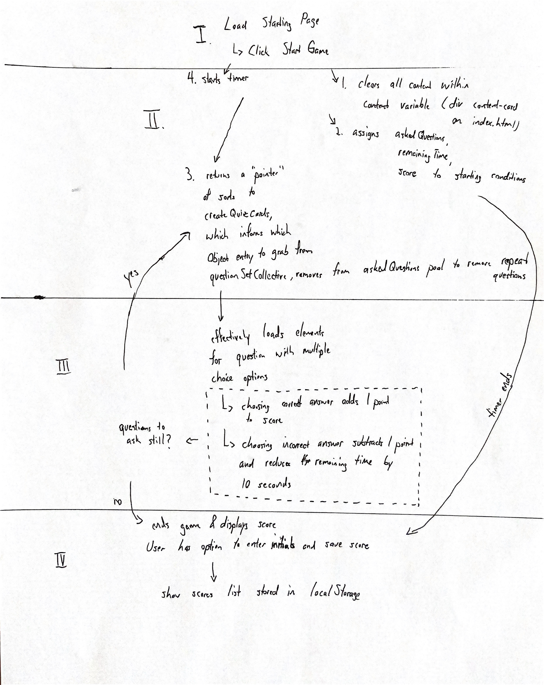

# Quiz Flashcards

## Description
The app asks a series of 5 question related to JavaScript language knowledge with multiple choice answers. The player gets a score based on how well he/she does and finally can enter name initials to add to a scoreboard. The game ends when the timer (60 seconds) expires or the player has finished answering all questions. The question order is randomized as are the multiple choice answers to discourage player from getting all answers correct via rote memorization.

## Architecture

The picture shows the flow of the game assuming a player starts the game, goes through each question, and reaches the end of the game without any wayward behavior along the way.

There are a multitude of helper functions that pass information between each other as well. The high level of the data flow is the following:
  - Player starts the game after loading the first screen.
  - Player then is presented with a new set of information on the screen: a question with 4 multiple choice answers. Player then chooses an answer.
  - Player then continues through each randomized question until he/she has answered all questions. At this point, the game ends.
  - Player is presented with his/her score and input to store his/her name initials on the scoreboard.
  - After submitting initials, the player is taken to the scoreboard which is sorted by highest score to lowest score.

  At a more detailed look of each of the functions:

  - startLoad
  - clearCardContent
  - startGame
  - setTime
  - getRandomInt
  - randomizeAnswerOrder
  - createQuizCards
  - correctSelection
  - incorrectSelection
  - endQuiz
  - submitInitials
  - showScoresPage

  ### startLoad
  This function effectively clears the content-card of any children and presents the elements for when the player first loads the page. This function is also called if the player clicks "Go back?" when on the score page. Notice that this function is also invoked on line 58 of the script.js to allow for the game start button to appear and start the sequence of events.

  ### clearCardContent
  This function clears the children of content-card div.

  ### startGame
  This function performs four tasks:
    1. It calls clearCardContent function.
    2. It resets the global variables tracked for each game session to the "initial" state.
    3. It chains getting a value from getRandomInt and then calling that value on createQuizCards. These both will be elaborated more later on.
    4. It invokes the setTime function to start the 60 second timer.

  ### setTime
  This function sets at 60 second time interval where every second will update the timer on the top right of the page to how many seconds are left. There are also two conditions within this function:
    1. If the time is up and there are still questions left unanswered, the time interval is cleared and the game ends.
    2. If there are no questions left unanswered, then the game ends regardless of how much time is left. The time interval is cleared and the logic for ending the game is taken into account elsewhere (correctSelection & incorrectSelection functions).

  ### getRandomInt
  This function grabs a random number between 0 through 4 (4 being 1 less than the length of the number of quetsions to be asked as this takes 0-indexing of arrays into account.) Then a switch statement removes the number index of question from askedQuestions and evaluates which corresponding object key to return from questionSetCollective variable. By removing the number from askedQuestions, there are no repeat questions and the app can track if all questions have been asked.

  ### createQuizCards
  This function takes input as the return value of getRandomInt. This function creates a question header where the question itself goes and a questionList ordered list. Both of these are extracted from the variable currentQuestionSet which takes the key from return of getRandomInt and uses the values. Next these answers are randomized and then each answer takes an id according to whether it is a correct ansewr or an incorrect answer. Finally the function adds each answer to the questionList.

  ### correctSelection
  This function adds 1 to the score and updates the score displayed at the top left of the page. It then checks if there are any remaining questions in which case it uses the same chained functions as in startGame 3 above; if not then the game ends via calling endQuiz.

  ### incorrectSelection
  This function removes 10 seconds from the remaining time and takes 1 from the score. It updates the score displayed on the top left of the page. This also uses the same check in correctSelection.

  ### endQuiz
  This function calls the clearCardContent function and then displays the current score, an input for the player to type his/her initials, and a submit button. Clicking the submit button invokes the submitInitials function.

  ### submitInitials
  This function takes the text input from endQuiz input. It will then do one of two things:
    - If the scoreCollection object already exists within localStorage (after being extracted from JSON.parse), the new initials and score are appended within an array to the scoreCollection object. This is then set to localStorage to keep track of existing scores as well as the newest entry.
    - If the scoreCollection object doesn't exist, then it is initialized as an empty object. The new initials and score are appended within an array to the newly created scoreCollection and set to localStorage.

  ### showScoresPage
  This function begins with checking if there is an existing scoreCollection within localStorage. A button container with a "go back" button is displayed. Depending on if there are existing scores then two interactions can happen:
    - If there are no exisiting scores, then there are no more buttons to display and the current header will show as "No scores available".
    - If there are existing scores, then the scoreCollection is sorted and stored in a new variable named sorted. A header with text content added to the page. Two more buttons are added as well: restart and clear scores. Finally a list is added with each entry within sorted array that displays the initials and score. Lastly clearScores button has the eventListener added within showScoresPage to remove the scoreCollection from localStorage, empty the scoreList, remove the resetButton and clearScores button, and changes the header to "No Scores available". Ideally this eventListener would be added along with the eventListeners at the end of the script.js file but as there are moving parts involved with the showScoresPage, I left it here for now.

  ## Additional Notes/Thoughts on improvement
  The code is built with hardcoded set of questions and answers (variable questionSetCollective within script.js). This also has hard-coded data that are tied including the cases within the switch statement of getRandomInt and askedQuestions array within startGame. Editing the questionSetCollective or adding new sets needs to update the two hard-coded data as well. Lastly submitting initials that already exist within the localStorage scoreCollection object will result in replacing the existing initials: score instead of adding a new entry. 